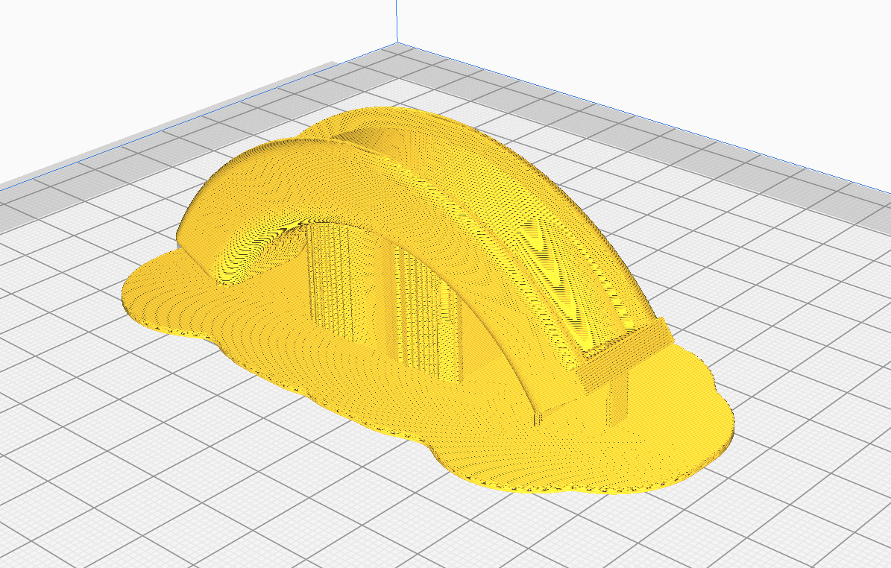
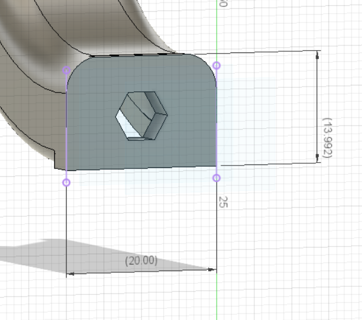

# ハンズフリーノブ

ドアノブをハンズフリー化するキットです。
マウンタ部はお使いのドアノブに合わせてカスタマイズしてご利用ください。

## 同梱物について

./
│  README.md            このファイルです。
│  LICENSE              MIT License
│  handsfreeknob.iges   IGES形式3D CADファイル
│  handsfreeknob.step   STEP形式3D CADファイル
│  sample_slice.png     説明用画像
│  joint_part.png       説明用画像
│  
└─stl
        armhook.stl      フック部分のSTLファイル
        mounter-C.stl    マウンタCのSTLファイル
        mounter-D.stl    マウンタDのSTLファイル
        

## プリントの他に必要な部品

接合のためにM5サイズのネジとナットを使います。
別途ご用意ください。

- M5 ナベネジ x 2
- M5 ナット x 2
- M5 ワッシャー x 2

## フック部のスライスについて

スライスのイメージです。
FDMの場合、この向きでプリントすると強度が出ると思います。

## フック部をマウントする受け口のサイズについて

20mm x 14mmの矩形となっています。
マウンタを自作する場合に参考にしてください。

# 著作権 copyright

この3Dデータおよび文章の著作権は本橋大輔が保有し、MITライセンスで公開します。
この3Dデータおよび文章を誰でも無償で無制限に扱うことができます。ただし、著作権表示および本許諾表示をソフトウェアのすべての複製または重要な部分に記載しなければなりません。また、配布物に LICENSEファイル を同梱してください。
作者または著作権者は、3Dデータおよび文章に関してなんら責任を負いません。

